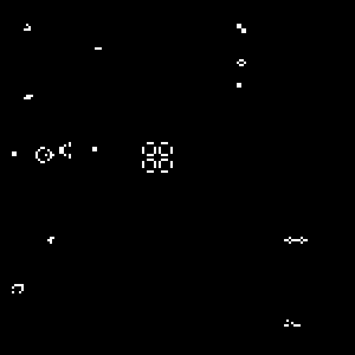

# Conway's Game of Life

A real-time implementation of Conway's Game of Life in Rust, rendered with [raylib](https://github.com/deltaphc/raylib-rs) through a custom software framebuffer.



## How it works

The simulation lives entirely inside a small `Framebuffer` (a `Vec<Color>` plus a `point`-style setter and a `get_color` getter). There is no separate boolean grid for cell state — a cell is "alive" when its pixel is white and "dead" when it's black, and the game logic reads and writes that state directly through `set_pixel` / `get_color`.

Because you can't safely read and write the same generation at once, the game keeps **two framebuffers** (`current` and `next`):

1. For every cell, count how many of its 8 neighbors are alive by reading `current` with `get_color` (cells outside the buffer read as the background color, so the edges of the world are effectively "dead" — no special-casing needed).
2. Apply Conway's four rules and write the resulting color into `next` with `set_pixel`.
3. Swap `current` and `next` and repeat.

Each generation writes every single pixel, so the framebuffer is never explicitly cleared between frames — the simulation itself takes care of "erasing" dead cells.

The simulation grid is intentionally small (150x150 cells) and gets scaled up to fill the actual window on every frame, so the game stays readable and fast even though the window can be resized freely.

## Rules

For every cell, each generation:

- A live cell with fewer than 2 live neighbors dies (underpopulation).
- A live cell with 2 or 3 live neighbors survives.
- A live cell with more than 3 live neighbors dies (overpopulation).
- A dead cell with exactly 3 live neighbors becomes alive (reproduction).

## Seed patterns

The initial generation seeds 12 classic patterns side by side on the grid:

| Pattern | Type | Notes |
|---|---|---|
| Glider | Spaceship | Travels diagonally forever |
| Blinker | Oscillator (period 2) | The simplest oscillator |
| Toad | Oscillator (period 2) | 6-cell oscillator |
| Pulsar | Oscillator (period 3) | 48-cell, 4-way symmetric |
| Pentadecathlon | Oscillator (period 15) | Long-lived, elongated oscillator |
| Beacon | Oscillator (period 2) | Two blocks touching corners |
| Block | Still life | The simplest static pattern |
| Beehive | Still life | 6-cell static pattern |
| R-pentomino | Methuselah | Chaotic for ~1103 generations before stabilizing |
| Acorn | Methuselah | Takes 5206 generations to stabilize, spawns several gliders |
| Lightweight spaceship (LWSS) | Spaceship | Travels horizontally |
| Gosper glider gun | Gun | Fires a new glider every 30 generations, forever |

## Controls

- **Window resize**: the framebuffer is rescaled to fit the new window size automatically.
- **C**: save the current framebuffer as `Screenshot.png` in the working directory.

## Running it

```bash
cargo run
```

## Regenerating the demo GIF

`src/bin/capture_gif.rs` is a small headless binary that runs the same simulation (no window needed) and writes `demo.gif` by encoding the framebuffer state every couple of generations:

```bash
cargo run --bin capture_gif --release
```

## Project structure

- `src/main.rs` — window setup and the main loop.
- `src/framebuffer.rs` — the software framebuffer: `set_pixel`/`get_color`, clearing, BMP/PNG export, and blitting to the raylib window.
- `src/game_of_life.rs` — neighbor counting and the `step` function that applies Conway's rules.
- `src/patterns.rs` — one function per seed organism.
- `src/line.rs`, `src/polygon.rs` — line/polygon drawing helpers from an earlier exercise, kept for reference.
- `src/bin/capture_gif.rs` — standalone binary that renders the simulation straight to a GIF.
